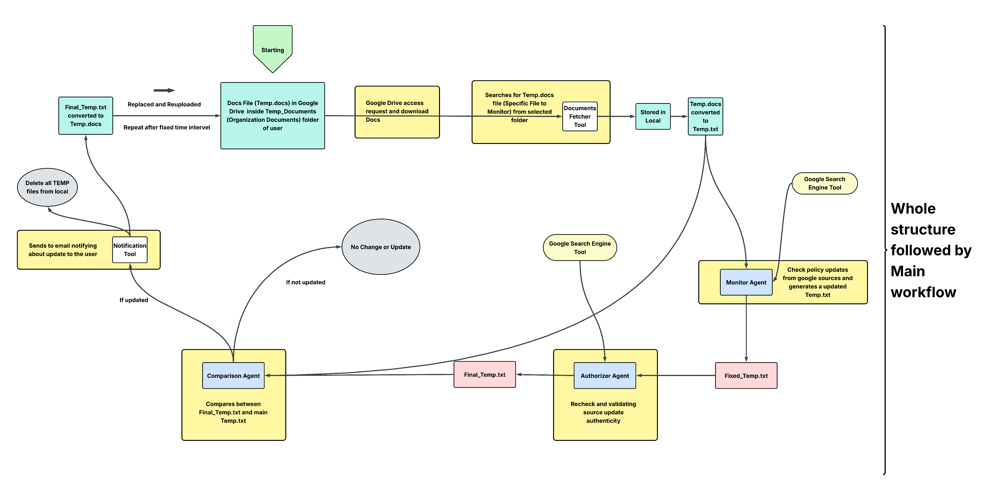

# 🛡️ policy-compliance-guardian

An **agentic workflow** that keeps an organization’s policy documents up-to-date, verified, and synchronized with Google Drive.

At a high level, `policy-compliance-guardian`:

1. Fetches a policy document from **Google Drive**.
2. Runs a **Monitor Agent** to analyze and minimally correct the text.
3. Runs an **Authorizer Agent** to validate those monitored changes against trusted web sources.
4. Runs a **Comparison Agent** to compare the newly authorized text against the existing baseline.
5. Optionally sends a notification email, cleans up old snapshots, and pushes the updated policy back to Google Drive.

You can run this workflow once, or let it run periodically via the scheduler in `main_workflow.py`.

---

## ✨ Key Components & Features

- 🔁 **End-to-end policy pipeline**
  - Monitor → Authorize → Compare → Notify/Sync.
- 📄 **Docs Fetcher Tool**
  - Pulls a Google Docs policy file (e.g. `temp.docs`) from a configured Drive folder and saves it locally as `temp.txt`.
- 🔍 **Monitor Agent**
  - Reads the local baseline policy file (e.g. `src/temp/data/temp.txt`).
  - Optionally calls a `google_search_agent` sub-agent for fact-checking or context.
  - Writes monitored artifacts (raw corrected text, JSON snapshot, and summary) into a timestamped directory under:
    - `src/temp/data/monitored_snapshots/<USER_EMAIL>_monitored_file/`
- ✅ **Authorizer Agent**
  - Consumes the Monitor Agent’s artifacts (summary, JSON metadata, and raw monitored text).
  - Re-validates the content against trusted web sources via a `google_search_agent`.
  - Detects tampering, inconsistencies, or outdated references and decides whether the monitored changes should be accepted.
  - Writes authorized artifacts (summary, JSON, raw text) into a timestamped directory under
    `src/temp/data/authorized_snapshots/<USER_EMAIL>_authorized_file/`.
- 📊 **Comparison Agent**
  - Compares the existing baseline policy (e.g. `temp.txt`) with the newly authorized policy text.
  - Generates a concise diff-style summary and a decision flag (e.g. `has_changes`) indicating whether meaningful, trusted updates exist.
- ✉️ **Notifier Tool**
  - Sends a short Gmail status email at the end of a run (for example, “policy updated” or “no change”).
  - Deletes old monitored and authorized snapshot folders to avoid clutter.
  - Uploads the latest `temp.txt` back to Google Drive as `temp.docs`, closing the loop so users always see the up-to-date, authorized version in Drive.
- 📆 **Scheduler**
  - `main_workflow.py` defines:
    - `full_workflow()` → runs Monitor → Authorizer → Comparison once.
    - `run_every_n_days(interval_days, full_workflow)` → loops forever, refreshing docs from Drive and calling `full_workflow()` on a cadence controlled by an environment variable.

---

## 🧱 High-Level Architecture

> The project centers around a recurring workflow that monitors one policy file.




### Main flow

1. **Fetch from Google Drive (Docs Fetcher Tool)**
   - Uses the Google Drive API and Google OAuth 2.0 service account.
   - Finds a specific folder on Drive (for example, `Test_Documents`).
   - Locates a policy document named `temp.docs` in that folder.
   - Exports the Google Docs file as plain text and writes it to:
     - `src/temp/data/temp.txt`

2. **Monitor Agent**
   - Loads the baseline policy from `src/temp/data/temp.txt` using its `fetch_file_content(file_path)` tool
   - Optionally calls a `google_search_agent` sub-agent (backed by Gemini and a `google_search` tool) to gather evidence about definitions, references, or policy-specific terms.
   - Produces and saves three kinds of monitored artifacts under
     `src/temp/data/monitored_snapshots/<USER_EMAIL>_monitored_file/`:
     - `raw_monitored_file.<timestamp>.txt` – minimally corrected policy text
     - `monitored_file.<timestamp>.json` – JSON snapshot with original content and search results
     - `monitored_file_summary.<timestamp>.txt` – human-readable summary including updated/snapshot paths

3. **Authorizer Agent**
   - Reads the Monitor Agent’s summary, JSON snapshot, and raw monitored text.
   - Uses a `google_search_agent` again to validate:
     - Authenticity of sources.
     - Correctness and freshness of references.
     - Suspicious or conflicting content.
   - Classifies and decides whether the monitored updates should be accepted.
   - Writes authorized artifacts (summary, JSON, raw text) into a per-user, timestamped directory under:
     - `src/temp/data/authorized_snapshots/<USER_EMAIL>_authorized_file/`

4. **Comparison Agent**
   - Compares the current baseline `temp.txt` with the latest authorized policy text from the snapshots.
   - Distinguishes between real, authorized changes and trivial or duplicate content.
   - Emits a small structured result (for example `has_changes`, `change_summary`) used to decide whether to update the baseline.

5. **Notifier Tool (Gmail + Cleanup + Drive Sync)**
   - Sends a Gmail status message summarizing the run (e.g. whether policy was updated).
   - Deletes old monitored and authorized snapshot directories under `src/temp/data/`.
   - Uses the Google Drive API to find the policy document (e.g. `temp.docs`) in the configured folder and either:
     - Update its contents with the latest `temp.txt`, or
     - Create it if missing.

6. **Scheduler / Orchestrator (`main_workflow.py`)**
   - Orchestrates the entire pipeline:
     1. Fetch docs → 2. Monitor → 3. Authorize → 4. Compare → 5. Notify & Sync.
   - Provides a function (e.g. `full_workflow()`) that runs the pipeline once.
   - Provides a small async loop (e.g. `run_every_n_days(...)`) that can repeatedly call `full_workflow()`.
   - The `if __name__ == "__main__":` block typically starts this periodic loop.

## 🔧 Tools under `src/tools/`

### `docs_fetcher.py` — Google Drive Docs→Text Fetcher

A small utility that integrates with the Google Drive API to pull the policy source document into the local workflow.

- Uses a **service account** with `service_account.json` (Drive scope) via `google.oauth2.service_account`.
- Searches for a configured folder on Drive (for example `Test_Documents`).
- Searches that folder for a file named `temp.docs`.
- Exports the Google Docs file as plain text and writes it to:

  ```text
  src/temp/data/temp.txt
  ```

In `main_workflow.py`, this is called by the scheduler (`run_every_n_days`) before each `full_workflow()` run to refresh the baseline policy text.

### `notifier_tool.py` — Gmail notification, snapshot cleanup & Drive sync

A post-processing helper that is typically called at the very end of the workflow:

- Sends a short status email (e.g. “policy updated” / “no change”) using the Gmail API.
- Deletes old monitored and authorized snapshot folders under `src/temp/data/`.
- Uploads the latest `src/temp/data/temp.txt` back to Google Drive as `temp.docs` in the configured folder.

This closes the loop so the newly authorized policy text becomes the live document in your shared Drive.
---

## 📁 Repository Layout (example)

Your actual layout may differ slightly, but a typical structure looks like this:

```text
policy-compliance-guardian/
├─ src/
│  ├─ agents/
│  │  ├─ monitor_agent.py           # Monitor agent (uses Google ADK + tools for policy monitoring)
│  │  ├─ authorizer_agent.py        # Authorizer agent (validates monitored policies)
│  │  └─ comparison_agent.py        # Comparison agent (diffs baseline vs authorized snapshot)
│  ├── mcp-server/                 # MCP server providing interfaces to agents/tools
│  │  ├── mcp_server.py
│  │  ├── client.py
│  │  └── Docker & compose setup
│  ├─ tools/
│  │  ├─ docs_fetcher.py            # fetch_temp_docs: pulls Google Docs → temp.txt
│  │  └─ notifier_tool.py           # Gmail notification, snapshot cleanup, Drive upload/replace
│  └─ temp/
│     └─ data/
│        ├─ temp.txt                # Baseline policy text
│        ├─ monitored_snapshots/    # Monitor Agent outputs
│        └─ authorized_snapshots/   # Authorizer Agent outputs
├─ main_workflow.py                 # Main entrypoint for running the workflow
└─ README.md
```
If you use a different directory layout, adjust the paths in the agents and tools accordingly.

---
## ⚙️ Setup

### 1. Clone the repo

```bash
git clone https://github.com/wllnju/policy-compliance-guardian.git
cd policy-compliance-guardian
```

### 2. Python environment

Create and activate a virtual environment, then install dependencies:

```bash
python -m venv .venv
source .venv/bin/activate   # Windows: .venv\Scripts\activate
pip install -r requirements.txt
```

### 3. Environment variables

Create a `.env` file in the project root with at least:

```env
GOOGLE_API_KEY=your_gemini_or_genai_api_key
USER_EMAIL=your.name@your-org.com

# How often the full workflow runs when using the internal scheduler (in days)
WORKFLOW_RUN_INTERVAL_DAYS=7
```

- `GOOGLE_API_KEY` is used by the agents’ LLMs and `google_search` tools.
- `USER_EMAIL` may be used for directory naming and/or notification targeting.
- `WORKFLOW_INTERVAL_DAYS` controls how often the built-in scheduler in `main_workflow.py` runs the pipeline if you execute it directly.

### 4. Google OAuth credentials

This project uses **two types of Google credentials**:

1. **Service account for Google Drive (used by `docs_fetcher.py`)**
   - A **service account key JSON** file saved as:
     ```text
     src/tools/service_account.json
     ```
   - The Drive folder (for example `Test_Documents`) must be **shared with the service account email** with at least Editor access.
   - `docs_fetcher.py` uses this file (via `google.oauth2.service_account`) to read from and write to Google Drive **without** any OAuth browser popup.

2. **User OAuth for Gmail (used by `notifier_tool.py`)**
   - An OAuth **`credentials.json`** file (Desktop application) downloaded from Google Cloud Console.
   - A cached token file created on first run:
     ```text
     src/tools/notifier_token.json
     ```
   - `notifier_tool.py` uses these (via `InstalledAppFlow` and `google.oauth2.credentials.Credentials`) to send email using the Gmail API.

Make sure all of these JSON/token files are **not** committed to Git. Add them to `.gitignore`.

---

## 🚀 Running the Workflow

### A. Run once (manual)

The current `main_workflow.py` entrypoint starts the **internal scheduler** by default. If you want to run the pipeline only once, the simplest pattern is to call it from a small helper script:

```python
# run_once.py
import asyncio
from src.tools.docs_fetcher import fetch_temp_docs
from main_workflow import full_workflow

if __name__ == "__main__":
    fetch_temp_docs()        # Step 1: refresh temp.txt from Google Drive
    asyncio.run(full_workflow())  # Step 2: run monitor → authorizer → comparison
```

Then run:

```bash
python run_once.py
```

This uses the same `full_workflow()` function as the scheduler but avoids the infinite loop.

### B. Run periodically with the built-in scheduler

`main_workflow.py` already wires up an internal async loop:

- It reads `WORKFLOW_RUN_INTERVAL_DAYS` from the environment.
- It calls `run_every_n_days(WORKFLOW_RUN_INTERVAL_DAYS, full_workflow)`.
- Before each workflow run, it calls `fetch_temp_docs()` to pull the latest `temp.docs` from Drive.

To start the scheduler:

```bash
python main_workflow.py
```

This will:

1. Fetch the latest documents from Google Drive (`fetch_temp_docs()`).
2. Run the full workflow (monitor → authorize → compare).
3. Sleep for `WORKFLOW_RUN_INTERVAL_DAYS` days.
4. Repeat.

### C. Schedule externally (optional)

If you prefer to use your own scheduler (cron, Airflow, Cloud Run, etc.), you can:

1. Keep `full_workflow()` as the main callable.
2. Create a thin wrapper (similar to `run_once.py`) that:
   - Calls `fetch_temp_docs()`.
   - Then calls `full_workflow()` once and exits.

Your external scheduler can then trigger that wrapper script on whatever cadence you need.

---

## 🔐 Handling Credentials Safely

- **Never** commit `credentials.json` and `service_account.json`, token files, or `.env` to version control.
- Use `.gitignore` to keep secrets and local artifacts out of Git.
- If you accidentally commit a secret:
  1. Rotate or revoke it in the Google Cloud Console / Google Account.
  2. Clean your Git history (for example with `git filter-repo`) if necessary.

---

## 🧪 Extending the System

Some ideas for extending `policy-compliance-guardian`:

- Add a **Notification Agent**:
  - Summarizes changes in more user-friendly language.
  - Sends Slack / Teams messages in addition to email.
- Add a **UI dashboard**:
  - Lists recent runs, diffs, classifications, and status.
  - Allows manual approval / override of specific changes.
- Support **multiple policies**:
  - Privacy policy, AI usage policy, terms of service, etc.
  - Store metadata and status per policy file.
- Add structured logging and metrics:
  - Export run metadata to BigQuery, a database, or a log aggregator.

---

## 🤝 Contributing

1. Fork the repo and create a feature branch.
2. Keep changes modular; aim for small, composable agent and tool functions.
3. Add or update tests / example scripts where relevant.
4. Open a PR with a clear description, logs, and/or screenshots if helpful.

---

## 📄 License

This project is licensed under the MIT License – see the [LICENSE](LICENSE) file for details.
